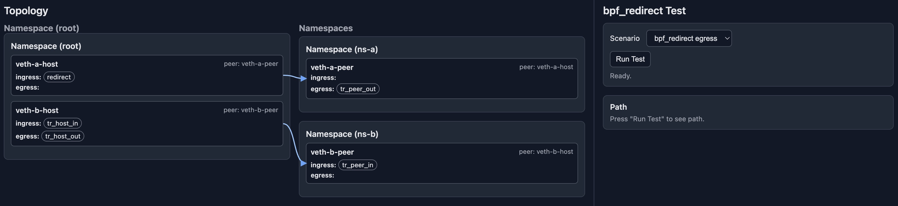
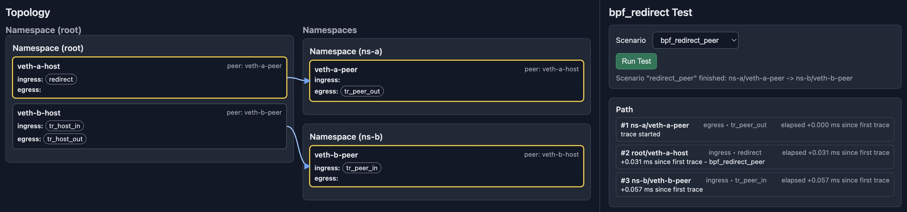

# redirect

## prerequisites
* Kernel Version > 5.10
* lbbpf
* go
* llvm Version > 15
* clang Version > 15

## How to Build
```shell
make build
```

## How To Test
### Step1 - app exec
```shell
sudo TEST_ADDRESS=<ip address:port> BPF_OBJECT_PATH=`pwd`/bpf/trace_program.o
```

### Step2 - access it through the browser


### Step3 - run test
#### bpf_redirect result

#### bpf_redirect_peer result
